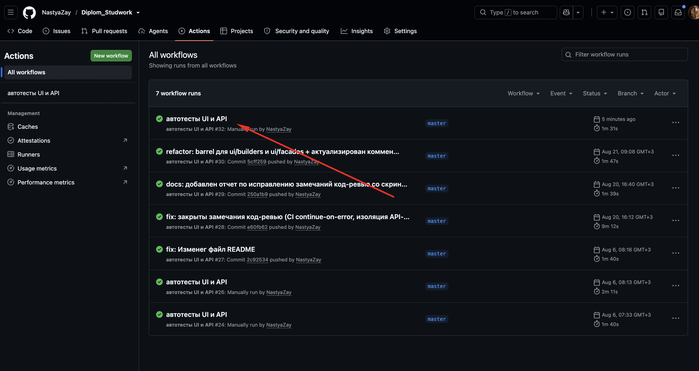
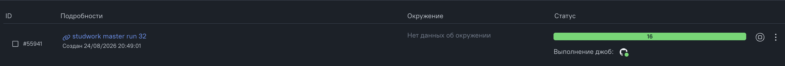
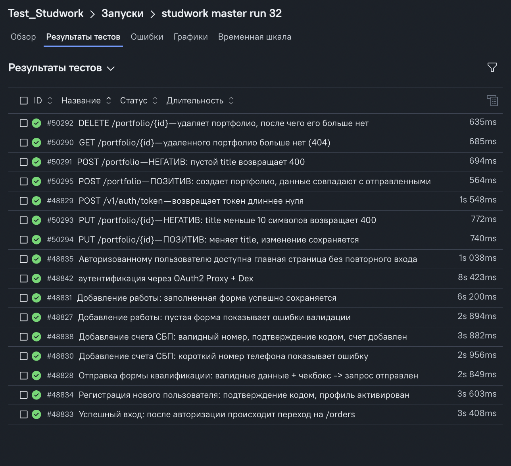
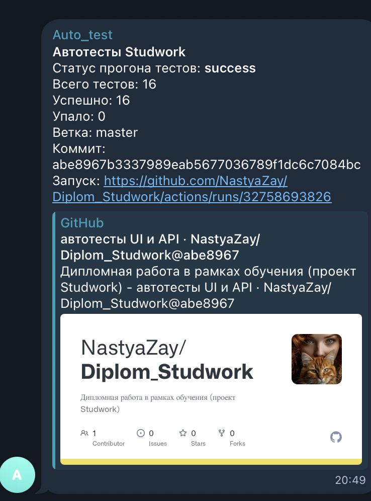

# 🛠 Отчет №2 по исправлению замечаний

## 📊 Сводка

| Приоритет    | Всего | Статус        |
| ------------ | ----- | ------------- |
| 🔴 Критичные | 0     | —             |
| 🟠 Высокий   | 3     | ✅ исправлено |
| 🟡 Средний   | 3     | ✅ исправлено |
| 🟢 Низкий    | 2     | ✅ исправлено |

Все замечания исправлены.

---

## 🟠 Исправления высокого приоритета

### 1. Добавила файлы `index.js` для папок `ui/builders/` и `ui/facades/`

**Было:** UI-тесты импортировали билдер прямо из файла, а фасады раздавались по отдельным файлам - в этих двух папках не было общего файла `index.js`.

**Стало:** завела `index.js` в обеих папках, все импорты идут через него.

---

### 2. Переписала фасады: вместо переименований — осмысленные методы

Искала решение. Сначала думала обернуть каждый метод страницы в метод фасада, но поняла, что это то же самое переименование один в один — оно ничего не дает. Пришла к другому: каждый метод фасада теперь либо объединяет несколько шагов, либо прячет от теста внутреннее устройство. Технические клики убрала в приватные методы. Общей точкой входа сделала `StudworkApp` — по образцу уже готового `ApiFacade`.

**Было:** больше половины методов вызывали ровно один метод одной страницы и больше ничего.

**Стало:**

- **LoginFacade** — `loginFromHomePage()` делает весь вход одним методом.
- **AddWalletFacade** — `addWalletWithConfirmation()` проходит весь путь добавления счета и прячет подтверждение кодом; открытие формы убрано в приватный `#openWalletForm()`.
- **AddShopWorkFacade** — `fillWorkForm()` открывает форму и заполняет; открытие спрятано в `#openNewWorkForm()`.
- **QualificationFacade** — `acceptAndSubmit()` объединяет галочку согласия и отправку.
- **RegistrationFacade** — `submitRegistration()` заполняет форму, ловит код и вводит его, прячет подтверждение от теста.

**Почему:** чтобы тест работал с приложением на языке действий («войти», «добавить счет»), а не собирал сценарий из кликов сам.

Три метода (`openRegistrationTab`, `openSpecialization`, `submit`) остались короткими — не потому что недоделала, а потому что тесту нужно вставить проверку между шагами. Например, при регистрации: открыть страницу входа → проверить заголовок «Вход» → переключить вкладку → проверить заголовок «Регистрация». Если слепить это в один метод, промежуточную проверку вставить будет некуда. Убрать эти методы — значит сломать проверку в тесте, поэтому оставила осознанно.

📁 все 5 файлов `src/ui/facades/*.js`

---

### 3. Убрала обращения к страницам внутри фасада — все проверки через фасад

**Было:** тесты читали элементы страницы через внутренности фасада: `addWalletFacade.financePage.walletsTab`.

**Стало:** у каждого фасада завела методы, которые отдают нужный элемент для проверки (сам фасад проверок не делает — они только в тестах).

**Почему:** чтобы и действие, и проверка шли через фасад, а тест не знал про внутреннее устройство.

📁 все 6 UI-тестов + методы во всех 5 фасадах

Если в фасадах снова косячу - очень прошу дать развернутый комментарий "как необходимо" быть в моем случае. Буду очень вам благодарна.

---

## 🟡 Исправления среднего приоритета

### 4. Тесты API теперь убирают за собой созданные данные

**Было:** два теста на изменение и позитивный тест на создание оставляли портфолио на стенде — три лишних записи за прогон.

**Стало:** добавила уборку `cleanup` — тест регистрирует удаление, оно выполняется после теста. Если запись уже удалена самим тестом, уборка тихо пропускает.

```js
cleanup(() => apiFacade.portfolio.remove(body.portfolio.id));
```

**Почему:** чтобы стенд не засорялся — что тест создал, то он и убрал.

📁 `src/fixtures/api.js` · `tests/api/portfolio.spec.js`

---

### 5. Проверила все поля на итоговой странице работы магазина

**Было:** проверялись всплывающее сообщение, заголовок и информер о модерации, а поля `description`, `workType`, `subject` — нет.

**Стало:** добавила проверки этих трех полей.

```js
await expect(app.shop.resultWorkType(work.workType).first()).toBeVisible();
await expect(app.shop.resultSubject(work.subject).first()).toBeVisible();
await expect(
  app.shop.descriptionMarker(work.description.split(".")[0]),
).toBeVisible();
```

**Почему:** чтобы тест ловил потерю любого поля, а не только заголовка.

📁 `src/ui/pages/NewWorkPage.js` · `src/ui/facades/AddShopWorkFacade.js` · `tests/ui/shop/add-shop-work.positive.spec.js`

---

### 6. Собрала код фреймворка в папку `src/`

**Было:** папки `api/`, `ui/`, `fixtures/`, `tests/` лежали в корне одним уровнем.

**Стало:** перенесла `api/`, `ui/`, `fixtures/` в `src/`. Тесты оставила в корне. Поправила все импорты под новую глубину пути.

**Почему:** чтобы код фреймворка был отдельно от конфигов, а корень оставался чистым.

📁 `src/` · все импорты в `tests/**` и внутри `src/**`

---

## 🟢 Исправления низкого приоритета

### 7. Убрала устаревший комментарий у `workers: 1`

**Было:** комментарий объяснял `workers: 1` тем, что кейсы портфолио связаны. Эту связь я сняла еще в прошлый раз — комментарий вводил в заблуждение.

**Стало:** комментарий убрала. Сам `workers: 1` оставила (стенд за VPN, последовательный запуск стабильнее).

📁 `playwright.config.js`

---

### 8. Настроила ESLint

**Было:** проверки стиля кода в проекте не было.

**Стало:** добавила файл настроек `eslint.config.js` и команды `lint` и `lint:fix`. Правила поставила на уровень «предупреждение», а не «ошибка», чтобы редактор не подсвечивал нормальный код красным.

**Почему:** чтобы стиль кода проверялся автоматически, а не только глазами.

📁 `eslint.config.js` · `package.json`

---

## 🚀 Результаты запуска

## CI/CD (GitHub Actions)



## Список запусков в Allure TestOps




## Уведомления в Telegram


