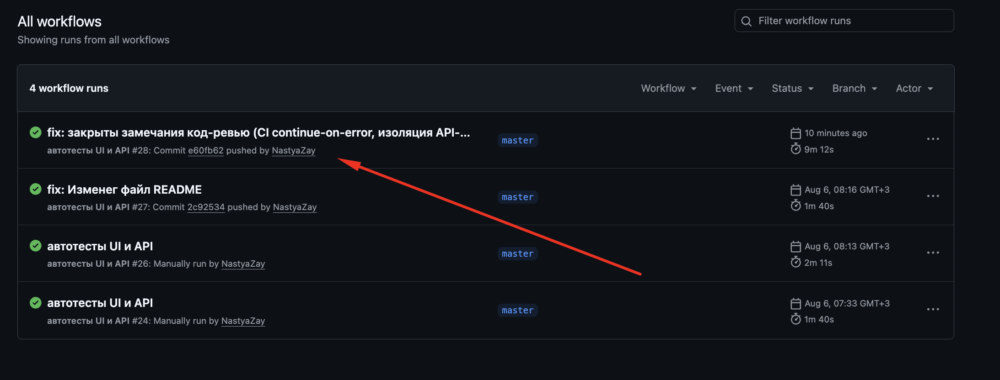
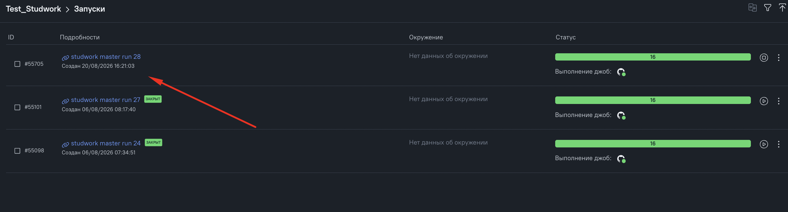
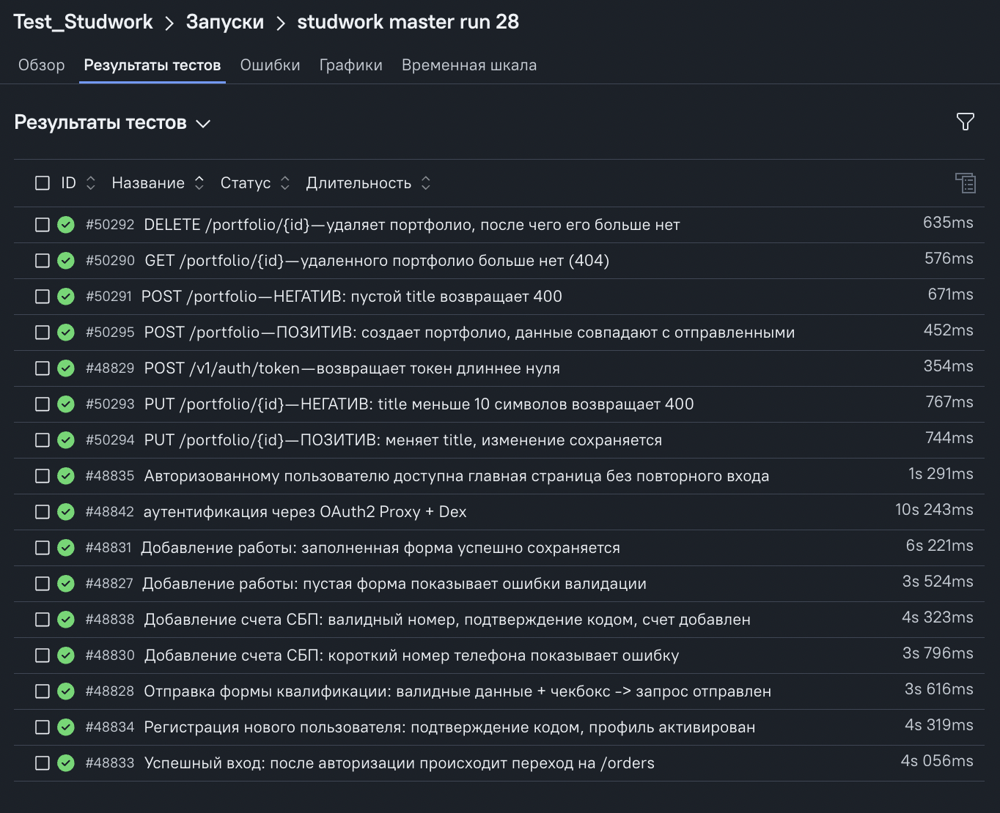
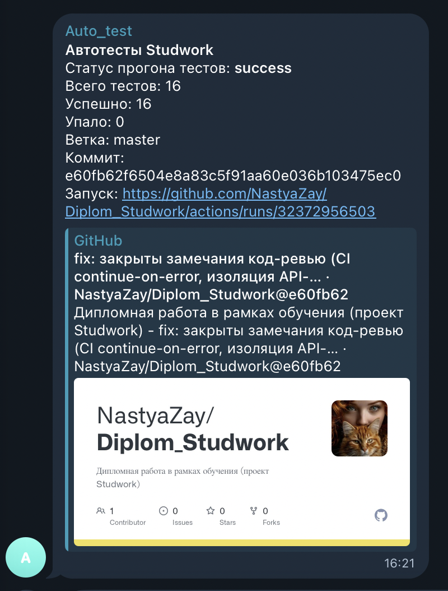

# 🛠 Отчет по исправлению замечаний 

Все блокирующие пункты (🔴 критичные и 🟠 высокого приоритета) исправлены — работа готова к повторной приемке. Средний 🟡  и низкий приоритет 🟢 - не устраняла, взяла на заметку. 

## 📊 Сводка

| Приоритет      | Всего | Исправлено |
| -------------- | ----- | ---------- |
| 🔴 Критичные   | 4     | ✅ 4        |
| 🟠 Высокий     | 2     | ✅ 2        |
| 🟡 Средний     | 2     | ⏳ взято на заметку |
| 🟢 Низкий      | 1     | ⏳ взято на заметку |

---

## 🔴 Критичные правки

### 1. Убрала `continue-on-error` со шага запуска тестов

**Было:** на шаге `Запустить тесты` (`npx playwright test`) стоял флаг `continue-on-error: true`. Из-за него job в GitHub Actions оставался зеленым, даже если тесты падали — регрессия проходила незамеченной по статусу CI.

**Стало:** флаг убран. 

```yaml
# было
- name: Запустить тесты
  continue-on-error: true
  run: npx playwright test

# стало
- name: Запустить тесты
  run: npx playwright test
```

📁 `.github/workflows/main.yml`

---

### 2. Устранила зависимость API-тестов портфолио через общую переменную

**Было:** переменная `let createdId` объявлялась на уровне `describe`, заполнялась в позитивном тесте создания, а четыре последующих теста ее читали. Тесты не были самодостаточными — их нельзя запустить по отдельности.

**Стало:** тесты стали самодостаточные.

- **«Портфолио — создание»** — тестам не нужно готовое портфолио, они создают его сами.
- **«Портфолио — изменение, удаление, чтение»** — свежее портфолио создается в `beforeEach` перед каждым тестом. 

```js
test.describe("Портфолио — изменение, удаление, чтение", () => {
  let createdId;

  // готовим свежее портфолио перед КАЖДЫМ тестом группы
  test.beforeEach(async ({ apiFacade }) => {
    await apiFacade.authorize();
    const { fileId } = await apiFacade.uploadPreview();
    const payload = new PortfolioBuilder().withFileIds([fileId]).build();
    const { body } = await apiFacade.portfolio.create(payload);
    createdId = body.portfolio.id; // id именно этого теста
  });
});
```

📁 `tests/api/portfolio.spec.js`

---

### 3. Перенесла разбор ответа файлового эндпоинта из фасада в сервис

**Было:** `ApiFacade.uploadPreview()` сам лез внутрь `response.body.file.id`, то есть фасад знал конкретную форму JSON-ответа эндпоинта. Это смешение слоев — знание о форме ответа должно жить рядом с эндпоинтом.

**Стало:** извлечение `fileId` переехало в `FileService.uploadPreview()` — сервис, который отвечает за этот эндпоинт. `ApiFacade.uploadPreview()` теперь тонкая делегация.

```js
// api/facade/apiFacade.js — фасад только делегирует
async uploadPreview() {
  const file = readPreviewFile();
  return this.file.uploadPreview(file);
}

// api/services/fileService.js — форму ответа знает сам сервис
const body = await parseBody(response);
const fileId = body?.file?.id ?? null;
return { status: response.status(), body, fileId };
```

📁 `api/facade/apiFacade.js` · `api/services/fileService.js`

---

### 4. Убрала прямой `page.goto()` из UI-тестов — навигация через Page Object

**Было:** в 6 UI-тестах вызывался `page.goto(...)` прямо в теле теста, в обход Page Object.

**Стало:** завела `OrdersPage` с методом `open()` по образцу существующих страниц, зарегистрировала фикстуру `ordersPage` и добавила экспорт через `index.js`. Все тесты теперь навигируют через Page Object.

```js
// ui/pages/OrdersPage.js
export class OrdersPage {
  constructor(page) {
    this.page = page;
  }
  // открываем страницу заказов
  async open() {
    await this.page.goto("/orders");
  }
}

// в тесте — через фикстуру, а не голый page
await ordersPage.open();
```

📁 `ui/pages/OrdersPage.js` · `ui/pages/index.js` · `fixtures/ui.js`
📁 тесты: `add-wallet-sbp.positive` · `add-wallet-sbp.negative` · `add-shop-work.positive` · `add-shop-work.negative` · `qualification.positive` · `authorized-access.ui`

---

## 🟠 Высокий приоритет

### 5. Объединила шаги одной модалки в один метод фасада

**Было:** открытие модалки, выбор типа счета и ввод телефона — три шага внутри одной и той же модалки — были разбиты на три отдельных метода (`openAddWalletModal`, `chooseWalletType`, `enterPhone`). 

**Стало:** выбор типа и ввод телефона объединены в один осмысленный метод `fillWalletForm({ type, phone })`. Открытие модалки оставила отдельным методом — после него тест проверяет заголовок модалки.

```js
// шаг: заполнить форму счета (выбрать тип + ввести телефон) — все в одной модалке
async fillWalletForm({ type, phone }) {
  await this.walletModal.openTypeDropdown();
  await this.walletModal.selectType(type);
  await this.walletModal.fillPhone(phone);
}
```

📁 `ui/facades/AddWalletFacade.js`

---

### 6. Перенесла ожидаемые тексты ошибок в тесты

**Было:** ожидаемые строки ошибок лежали в отдельном файле `api/constants/errorMessages.js` и импортировались как `ERROR_MESSAGES.*` в 4 местах. Чтобы понять, что проверяет тест, приходилось открывать второй файл — тест переставал быть самодостаточной спецификацией.

**Стало:** папку `api/constants/` удалила, импорты убрала. Ожидаемые тексты ошибок стоят прямо в `expect()`.

```js
// ожидаемое значение — прямо в тесте
expect(body.error).toBe("Необходимо заполнить «Title».");
```

📁 `tests/api/portfolio.spec.js` (папка `api/constants/` удалена)

---


## ✅ Итоговый чек-лист

- [x] 🔴 `main.yml` — убран `continue-on-error` со шага тестов
- [x] 🔴 `portfolio.spec.js` — тесты независимы (`beforeEach` вместо общей `createdId`)
- [x] 🔴 `apiFacade.js` / `fileService.js` — разбор ответа перенесен в сервис
- [x] 🔴 6 UI-тестов — навигация через `OrdersPage` вместо прямого `page.goto()`
- [x] 🟠 `AddWalletFacade.js` — шаги одной модалки объединены в `fillWalletForm`
- [x] 🟠 `portfolio.spec.js` — тексты ошибок перенесены, `api/constants/` удалена

**Все блокирующие замечания закрыты.**

Результат запуска тестов после фиксов:

## 🚀 CI/CD (GitHub Actions)


**Список запусков в Allure TestOps:**



## 📨 Уведомления в Telegram

