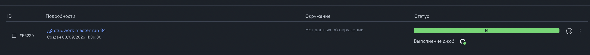
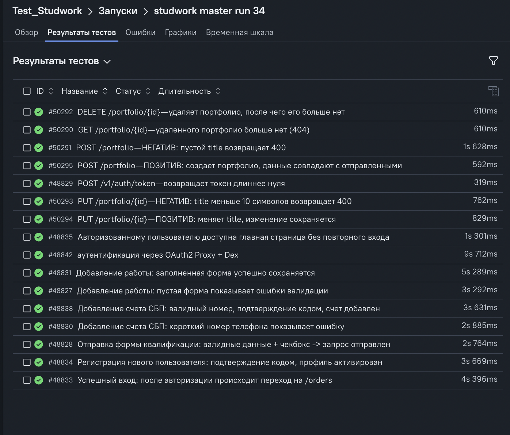
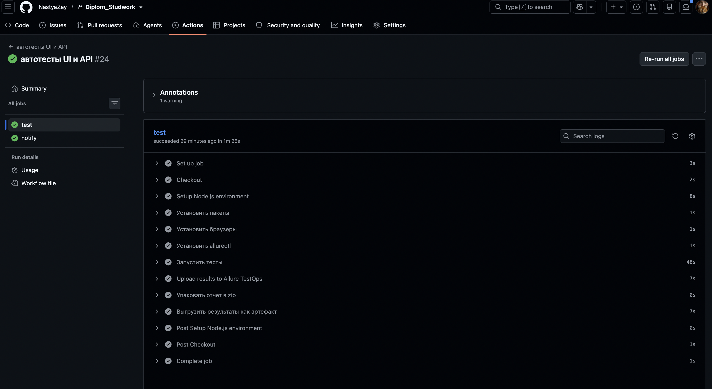
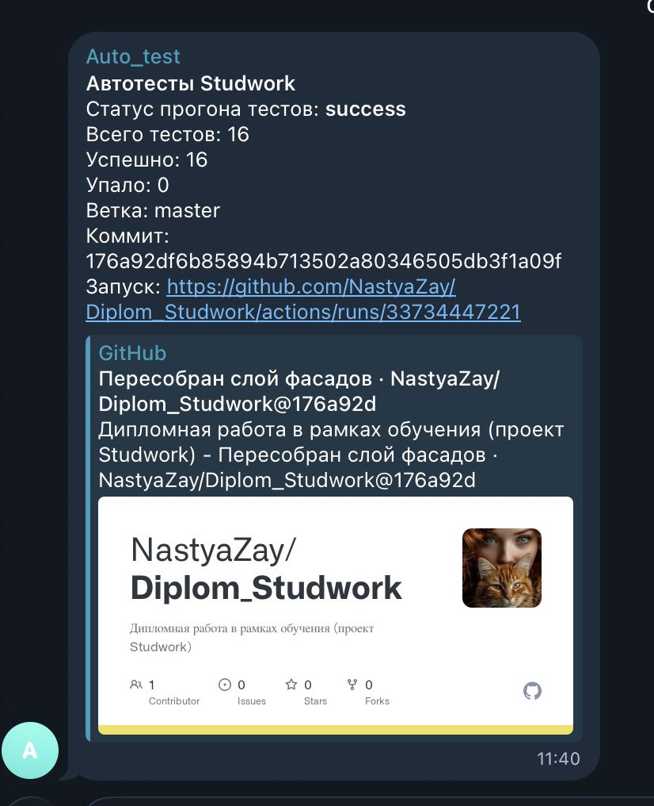

# 🎓 Дипломный проект: автоматизация тестирования Studwork | JavaScript + Playwright | UI и API

Мой дипломный проект по автоматизированному тестированию платформы **Studwork** (dev-стенд). Я автоматизировала функциональные **UI** и **API** тесты на JavaScript с использованием **Playwright** и настроила полноценный **CI/CD** с рассылкой уведомлений о результатах прогона.

---

## 📑 Содержание

- [Описание](#-описание)
- [Технологический стек](#-технологический-стек)
- [Архитектура и паттерны](#-архитектура-и-паттерны)
- [Структура проекта](#-структура-проекта)
- [Тестовое покрытие](#-тестовое-покрытие)
- [Установка](#-установка)
- [Настройка переменных окружения](#-настройка-переменных-окружения)
- [Запуск тестов](#-запуск-тестов)
- [Отчетность (Allure TestOps)](#-отчетность-allure-testops)
- [CI/CD (GitHub Actions)](#-cicd-github-actions)
- [Уведомления в Telegram](#-уведомления-в-telegram)

---

## 📝 Описание

В этом проекте я автоматизировала ключевые пользовательские сценарии платформы Studwork на двух уровнях:

- **UI-тесты** — проверяю поведение реального интерфейса: авторизацию, регистрацию, добавление работы в магазин, добавление платежного счета, заполнение квалификации.
- **API-тесты** — проверяю поведение бэкенда напрямую по HTTP: авторизацию и полный жизненный цикл портфолио (создание, изменение, удаление, проверку отсутствия).

Отдельная особенность стенда — многоступенчатый вход. Инфраструктурный доступ идет через **Dex (OAuth2 Proxy)**, а прикладной вход — уже через форму самого Studwork. Чтобы не логиниться заново в каждом сценарии, я переиспользую сессии между тестами.

---

## 🛠 Технологический стек

| Категория             | Технологии                                   |
| --------------------- | -------------------------------------------- |
| Язык                  | JavaScript (ESM)                             |
| Фреймворк             | Playwright Test                              |
| Тестовые данные       | @faker-js/faker                              |
| Конфигурация секретов | dotenv (`.env`)                              |
| Отчетность            | Allure TestOps, HTML Report (Playwright)     |
| CI/CD                 | GitHub Actions (self-hosted + ubuntu-latest) |
| Уведомления           | Telegram Bot API                             |

---

## 🏗 Архитектура и паттерны

Архитектура проекта выстроена согласно требованиям обучения и опирается на рекомендованные практики Playwright и общепринятые паттерны автоматизации тестирования.

### UI

- **Page Object Model** — каждая страница описана отдельным классом с локаторами и действиями;
- **Facade** — применяется точечно, только там, где за сценарием стоит подсистема, которую надо скрыть от теста: `AddWalletFacade` (прячет 2FA-подтверждение кодом) и `AddShopWorkFacade` (прячет навигацию через несколько страниц до формы). Домены без подсистемы (вход, регистрация, квалификация) обходятся без слоя-фасада — их страницы тест получает напрямую.
- **Агрегатор `StudworkApp`** — единая точка входа: отдает в тест и фасады (`app.wallet`, `app.shop`), и страницы напрямую (`app.loginPage`, `app.signUpPage` и др.).
- **Fixtures** — создают `StudworkApp` и отдают его в тест как `app`; фасады не создаются в тестах вручную.
- **Builder** — собирает данные форм; применяется для генерации валидных данных под каждый прогон.
- **Селекторы** — по приоритету `getByRole` → `getByText` → `getByPlaceholder`; применяются для поиска элементов так, как их видит пользователь.

### API

- **Service Object Model** — каждая группа ручек описана Service-классом, применяется для хранения URL, метода и заголовков эндпоинта в одном месте.
- **Facade** — `ApiFacade` объединяет служебные шаги (авторизация, раздача токена, загрузка файла); применяется для подготовки контекста перед проверкой.
- **Fixtures** — поднимают http-контекст с `API_BASE_URL` и отдают готовый фасад; применяются для изоляции запросов к API (отдельный хост от UI).
- **Builder** — собирает тело запроса, включая негативные варианты; применяется для гибкой сборки позитивных и негативных данных.

---

## 📂 Структура проекта

```
Diplom_Studwork/
├── .github/
│   └── workflows/
│       └── main.yml              # CI/CD: прогон тестов + уведомление в Telegram
├── src/                          # исходный код фреймворка
│   ├── api/                      # API-слой
│   │   ├── builders/             # билдеры тела запросов (faker внутри)
│   │   ├── facade/               # ApiFacade — фасад API-сценариев
│   │   ├── helpers/              # чтение файлов, парсинг тела ответа
│   │   └── services/             # Service-классы под ручки API
│   ├── fixtures/                 # фикстуры UI и API (+ merge в index.js)
│   └── ui/                       # UI-слой
│       ├── builders/             # билдеры UI-данных (faker внутри)
│       ├── facades/              # фасады UI-сценариев + агрегатор StudworkApp
│       └── pages/                # Page Objects (+ barrel index.js)
├── tests/
│   ├── api/                      # API-тесты (auth, portfolio)
│   ├── ui/                       # UI-тесты (auth, shop, finance, specialization)
│   ├── test-files/               # файлы для загрузки в тестах
│   └── auth.setup.js             # инфраструктурный вход через Dex
├── .env.example                  # шаблон переменных окружения
├── .gitignore
├── package.json
├── playwright.config.js          # baseURL, проекты, зависимости сессий
└── README.md
```

---

## ✅ Тестовое покрытие

### 🖥 UI-тесты

- **Успешный вход** — `tests/ui/auth/login.positive.spec.js`
- **Доступ авторизованному пользователю** — `tests/ui/auth/authorized-access.ui.spec.js`
- **Регистрация нового пользователя** — `tests/ui/auth/registration.positive.spec.js`
- **Магазин — добавление работы** — `tests/ui/shop/add-shop-work.positive.spec.js`
- **Магазин — пустая форма (негатив)** — `tests/ui/shop/add-shop-work.negative.spec.js`
- **Финансы — добавление счета СБП (позитив)** — `tests/ui/finance/add-wallet-sbp.positive.spec.js`
- **Финансы — добавление счета СБП (негатив)** — `tests/ui/finance/add-wallet-sbp.negative.spec.js`
- **Квалификация специалиста** — `tests/ui/specialization/qualification.positive.spec.js`

### 🔌 API-тесты

- **Авторизация** — `tests/api/auth.spec.js` · `POST /v1/auth/token`
- **Портфолио — создание (негатив)** — `tests/api/portfolio.spec.js` · `POST /portfolio`
- **Портфолио — создание (позитив)** — `tests/api/portfolio.spec.js` · `POST /portfolio`
- **Портфолио — изменение (негатив)** — `tests/api/portfolio.spec.js` · `PUT /portfolio/{id}`
- **Портфолио — изменение (позитив)** — `tests/api/portfolio.spec.js` · `PUT /portfolio/{id}`
- **Портфолио — удаление + идемпотентность** — `tests/api/portfolio.spec.js` · `DELETE /portfolio/{id}`
- **Портфолио — просмотр удаленного** — `tests/api/portfolio.spec.js` · `GET /portfolio/{id}`

## ⚙️ Установка

```bash
# 1. Клонировать репозиторий
git clone https://github.com/NastyaZay/Diplom_Studwork.git
cd Diplom_Studwork

# 2. Установить зависимости
npm install

# 3. Установить браузеры Playwright
npx playwright install
```

> ⚠️ Тесты обращаются к dev-стенду Studwork. Для доступа к стенду требуется рабочий VPN.

---

## 🔐 Настройка переменных окружения

Секреты я не храню в коде — они берутся из `.env`.

```bash
cp .env.example .env
```

| Переменная           | Назначение                                                 |
| -------------------- | ---------------------------------------------------------- |
| `BASE_URL`           | базовый адрес UI-стенда (для `page.goto`)                  |
| `TEST_USER_EMAIL`    | email для инфраструктурного входа через Dex                |
| `TEST_USER_PASSWORD` | пароль для входа через Dex                                 |
| `STUDWORK_LOGIN`     | логин/email тестового пользователя Studwork (UI + API)     |
| `STUDWORK_PASSWORD`  | пароль тестового пользователя Studwork                     |
| `API_BASE_URL`       | базовый адрес API (другой хост, чем UI!)                   |
| `STUDWORK_RECAPTCHA` | токен recaptcha для авторизации по API (на dev — заглушка) |
| `ALLURE_ENDPOINT`    | адрес сервера Allure TestOps                               |
| `ALLURE_PROJECT_ID`  | номер проекта в Allure TestOps                             |
| `ALLURE_TOKEN`       | личный API-токен из профиля Allure TestOps                 |

Реальный `.env` в репозиторий не попадает (закрыт в `.gitignore`), в репозитории остается только `.env.example`.

---

## ▶️ Запуск тестов

| Команда               | Описание                       |
| --------------------- | ------------------------------ |
| `npm test`            | запустить все тесты (UI + API) |
| `npm run test:ui`     | только UI-тесты                |
| `npm run test:api`    | только API-тесты               |
| `npm run test:headed` | запуск с видимым браузером     |
| `npm run test:debug`  | пошаговый режим отладки        |
| `npm run test:uimode` | запуск в UI Mode Playwright    |
| `npm run report`      | открыть HTML-отчет Playwright  |

Базовый запуск:

```bash
npx playwright test
```

> Тесты идут последовательно (workers: 1): это следствие цепочки UI-проектов, связанных через dependencies и storageState … API-кейсы портфолио, наоборот, независимы: beforeEach создаёт под каждый тест своё портфолио.

---

## 📊 Отчетность (Allure TestOps)

Для наглядных отчетов о прохождении тестов я использую **Allure TestOps**. Результаты
каждого прогона автоматически заливаются в TestOps прямо из CI (шаг
`allurectl upload allure-results`), поэтому каждый прогон виден как отдельный «Запуск»
с полной историей.

Локально результаты можно посмотреть и в обычном Allure-отчете:

```bash
# репортер allure-playwright уже подключен в playwright.config.js
# запустить тесты (результаты соберутся в allure-results/)
npx playwright test

# сгенерировать и открыть локальный HTML-отчет
npx allure serve allure-results
```

А в CI те же результаты уходят в Allure TestOps через `allurectl`:

```bash
allurectl upload allure-results
```

**Список запусков в Allure TestOps:**



**Результаты тестов прогона (15 тестов: 8 UI + 7 API, плюс setup-проект входа):**



---

## 🚀 CI/CD (GitHub Actions)

Прогон я настроила в `.github/workflows/main.yml` — он запускается автоматически при `push`/`pull_request` в `main`/`master`, а также вручную (`workflow_dispatch`).

Пайплайн состоит из двух связанных задач:

1. **`test`** — крутится на **self-hosted раннере** (моя машина с рабочим VPN, иначе тесты не достучатся до стенда). Ставит зависимости, ставит браузеры, гоняет тесты, упаковывает HTML-отчет в zip и выгружает его артефактом вместе с `results.json`.
2. **`notify`** — крутится на облачном **`ubuntu-latest`** (чистый интернет, откуда доступен Telegram). Скачивает артефакт, считает счетчики passed/failed и отправляет итог + сам отчет в Telegram.

Секреты (логины, пароли, токены) я храню в **GitHub Secrets** — они подставляются в окружение на этапе прогона.

**Пример запуска в GitHub Actions:**



---

## 📨 Уведомления в Telegram

После каждого прогона в Telegram-чат приходит:

- текстовый итог: статус прогона, всего тестов, успешно, упало, ветка, коммит, ссылка на запуск;
- сам HTML-отчет файлом (zip) — можно скачать и открыть локально.

Для работы уведомлений в GitHub Secrets я задаю:

| Секрет               | Назначение                  |
| -------------------- | --------------------------- |
| `TELEGRAM_BOT_TOKEN` | токен Telegram-бота         |
| `TELEGRAM_CHAT_ID`   | id чата/группы для отправки |

**Пример уведомления в Telegram:**



---
